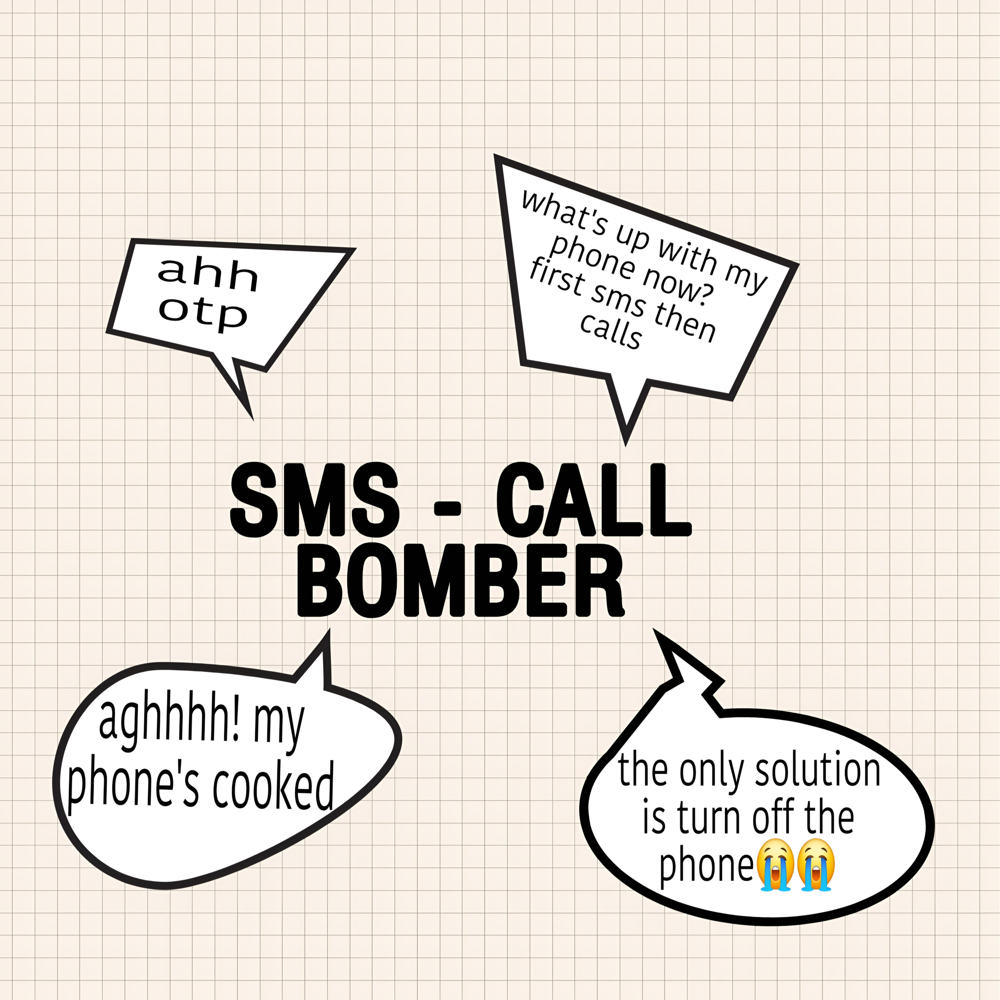

<div align="center">



# SMS Bomber

### High-Concurrency SMS / Voice OTP Testing Tool

[](https://www.python.org/)
[](LICENSE)
[](#installation)

</div>

---

## Overview

**SMS Bomber** is a lightweight Python-based high-concurrency SMS/voice OTP request testing utility.

The project is designed for authorized security research, development, endpoint testing, rate-limit evaluation, and controlled load testing.

### Features

- High-concurrency request handling
- Real-time terminal statistics
- Automatic cooldown handling
- Rotating User-Agent support
- Customizable endpoint configuration
- Lightweight Python implementation
- Cross-platform support
- Simple command-line interface

---

## Supported Platforms

| Platform | Support |
|---|:---:|
| Windows 10 / 11 | ✅ |
| macOS | ✅ |
| Linux | ✅ |
| Ubuntu / Debian | ✅ |
| Fedora | ✅ |
| Arch Linux | ✅ |
| WSL | ✅ |

---

# Installation

## Requirements

- Python 3.9 or newer
- Git
- Internet connection for installing Python packages

Check Python:

```bash
python --version
```

On systems where `python` points to Python 2 or is unavailable:

```bash
python3 --version
```

---

## Windows

### 1. Clone the repository

Open PowerShell or Command Prompt:

```powershell
git clone https://github.com/outwiles/sms-bomber.git
cd sms-bomber
```

### 2. Create a virtual environment

```powershell
python -m venv .venv
```

### 3. Activate it

```powershell
.venv\Scripts\activate
```

### 4. Install dependencies

```powershell
python -m pip install --upgrade pip
pip install -r requirements.txt
```

### 5. Start the program

```powershell
python bomb.py
```

---

# macOS

### 1. Clone

```bash
git clone https://github.com/outwiles/sms-bomber.git
cd sms-bomber
```

### 2. Create a virtual environment

```bash
python3 -m venv .venv
```

### 3. Activate it

```bash
source .venv/bin/activate
```

### 4. Install dependencies

```bash
python3 -m pip install --upgrade pip
pip3 install -r requirements.txt
```

### 5. Start

```bash
python3 bomb.py
```

---

# Linux

### 1. Clone

```bash
git clone https://github.com/outwiles/sms-bomber.git
cd sms-bomber
```

### 2. Create a virtual environment

```bash
python3 -m venv .venv
```

### 3. Activate it

```bash
source .venv/bin/activate
```

### 4. Install dependencies

```bash
python3 -m pip install --upgrade pip
pip3 install -r requirements.txt
```

### 5. Start

```bash
python3 bomb.py
```

### Debian / Ubuntu

If Python, Git, or `venv` is missing:

```bash
sudo apt update
sudo apt install python3 python3-pip python3-venv git
```

Then follow the Linux installation steps.

---

# Dependencies

Dependencies are listed in `requirements.txt`.

Current project dependencies include:

```text
requests
fake-useragent
cfonts
```

Install them with:

```bash
pip install -r requirements.txt
```

Or:

```bash
python3 -m pip install -r requirements.txt
```

---

# Project Structure

```text
sms-bomber/
│
├── assets/
│   └── bomb.jpg
│
├── bomb.py
├── requirements.txt
├── LICENSE
└── README.md
```

| File / Directory | Description |
|---|---|
| `bomb.py` | Main application |
| `requirements.txt` | Python dependencies |
| `assets/bomb.jpg` | Project logo / branding |
| `LICENSE` | MIT License |
| `README.md` | Documentation |

---

# Usage

Start the application from the project directory.

### Windows

```powershell
python bomb.py
```

### macOS / Linux

```bash
python3 bomb.py
```

The application provides its interactive terminal interface and runtime statistics.

Only use request-generation functionality against systems and endpoints that you own or have explicit authorization to test.

---

# Virtual Environment

A virtual environment keeps the project's dependencies isolated.

### Create

```bash
python -m venv .venv
```

### Windows

```powershell
.venv\Scripts\activate
```

### macOS / Linux

```bash
source .venv/bin/activate
```

### Install

```bash
pip install -r requirements.txt
```

### Deactivate

```bash
deactivate
```

---

# Troubleshooting

## `python` is not recognized on Windows

Try:

```powershell
py --version
```

Then:

```powershell
py -m pip install -r requirements.txt
py bomb.py
```

If Python is not installed, install it from:

https://www.python.org/downloads/

---

## `pip` is not recognized

Use:

```bash
python -m pip install -r requirements.txt
```

or:

```bash
python3 -m pip install -r requirements.txt
```

---

## `ModuleNotFoundError`

Reinstall the dependencies:

```bash
pip install -r requirements.txt
```

If you are using Python 3:

```bash
python3 -m pip install -r requirements.txt
```

---

## `fake_useragent` errors

Update the package:

```bash
pip install --upgrade fake-useragent
```

---

## Permission errors on Linux or macOS

Use a virtual environment instead of installing packages globally:

```bash
python3 -m venv .venv
source .venv/bin/activate
python3 -m pip install -r requirements.txt
```

---

# Responsible Use

This project can generate repeated requests and must be used responsibly.

Use it only for:

- Your own applications
- Local development environments
- Staging environments
- Authorized penetration testing
- Authorized load testing
- Security research with permission

Do not use it to disrupt third-party services, repeatedly trigger messages to people without consent, bypass provider protections, or interfere with telecommunications infrastructure.

You are responsible for complying with applicable laws, regulations, provider policies, and authorization requirements.

---

# Disclaimer

This software is provided **"as is"**, without warranty of any kind.

The author is not responsible for damage, service disruption, misuse, or other consequences resulting from use of this software.

Use the software only in environments where you have appropriate authorization.

---
# Credits

<p align="center">
  <b>Developed by Aashu</b><br/><br/>
  <a href="https://t.me/outwiles">
    
  </a>
  <a href="https://github.com/outwiles">
    
  </a>
  <a href="mailto:outwiles@proton.me">
    
  </a>
</p>

---

